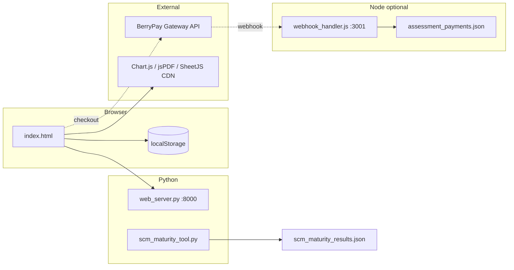

# SCM Maturity Assessment — E2E System Documentation

**Product:** Berry Consulting Supply Chain Maturity Assessment (SCMA / SCMM)  
**Last updated:** 2026-06-12  
**Status:** Standalone tool — web + CLI production-ready; BerryPay integration partial (client + webhook stub)

## Platform Core hub (2026-06-12)

SCM Maturity is standalone (no `PLATFORM_CORE_URL`). For Berry platform E2E, start `berry-platform-core` first per `planning-module-berry/docs/E2E_CROSS_REPO_INDEX.md` § 2026-06-12.

---

## Architecture



| Layer | Technology | Role |
|-------|------------|------|
| Frontend | Single-page `index.html` + inline JS | 25-question wizard, scoring, charts, exports |
| Static server | `web_server.py` | `SimpleHTTPRequestHandler`, port discovery |
| Engine (CLI) | `scm_maturity_tool.py` | Same pillar model; weighted scoring |
| Payments (client) | `berrypay_api.js`, `payment_integration.js` | Session creation hooks |
| Payments (server) | `webhook_handler.js` | HMAC webhook verification, JSON ledger |
| Scoring reference | `SCORING_GUIDE.md` | Per-question level examples |

---

## Services and ports

| Service | Port | Health / entry |
|---------|------|----------------|
| Web UI (Python) | **8000** (fallback 8001+) | `http://localhost:{port}/` |
| Webhook API (Node) | **3001** | `GET http://localhost:3001/health` |
| BerryPay Gateway | External | `BERRYPAY_*` env per `BERRYPAY_INTEGRATION.md` |

**Not used:** IAM, Postgres, Redis, Berry platform `platform-ports.json` (standalone repo).

---

## Assessment model

### Six pillars (25 questions)

| Pillar | Questions | Weight range |
|--------|-----------|--------------|
| Planning | 5 | 0.7–1.0 |
| Procurement | 4 | 0.7–0.9 |
| Logistics | 5 | 0.6–1.0 |
| Order-to-Cash | 4 | 0.7–0.9 |
| Technology | 4 | 0.7–1.0 |
| ESG & Compliance | 3 | 0.7–0.9 |

### Maturity levels (score thresholds)

| Level | Name | Overall score |
|-------|------|---------------|
| 1 | AD_HOC | &lt; 1.5 |
| 2 | FUNCTIONAL | 1.5 – &lt; 2.5 |
| 3 | INTEGRATED | 2.5 – &lt; 3.5 |
| 4 | OPTIMIZED | 3.5 – &lt; 4.5 |
| 5 | TRANSFORMATIONAL | ≥ 4.5 |

**Category score:** weighted average of question scores within pillar.  
**Overall score:** unweighted mean of six pillar averages (web and Python align).

### Consulting package mapping

| Package | Typical maturity | Price range |
|---------|------------------|-------------|
| Diagnostic | AD_HOC / FUNCTIONAL, score &lt; 2.5 | $3,000 – $8,000 |
| Advisory | INTEGRATED, 2.5 – &lt; 3.5 | $15,000 – $35,000 |
| Transformation | OPTIMIZED / TRANSFORMATIONAL | $50,000+ |

Contact surfaced in UI: `kenneth@berrycom.co.ke`, mailto quote buttons.

---

## Web UI capabilities (implemented)

| Feature | Verification |
|---------|--------------|
| Progress bar (25 steps) | Advances on Next |
| Scoring guide modal | **📊 Scoring Guide** per question (`scoringGuides` map) |
| 1–5 rating buttons | Required before Next |
| Results: gauge + radar (Chart.js) | After final question |
| Recommendations list | Weakest pillars + level-specific text |
| Consulting package card | Package name, scope, mailto / quote |
| Quick Demo | Pre-fills scores, skips to results |
| Export Excel | SheetJS `.xlsx` |
| Export PDF | jsPDF report |
| Assessment database (browser) | `localStorage` key `scmm_assessments` |
| Premium upgrade modal | BerryPay hook (`processPremiumPayment`) |
| Corporate billing request | UI flow; backend TBD |
| Content protection | `user-select: none`, watermark |

---

## CLI capabilities (implemented)

```powershell
python scm_maturity_tool.py          # interactive 25 prompts
python scm_maturity_tool.py --demo   # fixed demo vector → JSON
```

Output fields: `overall_score`, `maturity_level`, `category_scores`, `recommendations`, `consulting_package`.

---

## BerryPay integration (partial)

| Component | Status |
|-----------|--------|
| `berrypay_api.js` client | Implemented (expects gateway at `api.berrypay.com` or env) |
| `payment_integration.js` | UI wiring for premium + quotes |
| `webhook_handler.js` | `payment.completed`, `payment.failed`, `quote.accepted`, `subscription.created` |
| `assessment_payments.json` | Created on first webhook |
| Email confirmations | Stub (`sendPaymentConfirmation` TODO) |

See **BERRYPAY_INTEGRATION.md** for API contract.

---

## Data persistence

| Store | Key / file | Contents |
|-------|------------|----------|
| Browser | `scmm_assessments` | Completed runs (scores, level, timestamp) |
| Browser | `scma_user_profile` | Company/email for payments |
| Disk | `scm_maturity_results.json` | CLI `--demo` or save=yes |
| Disk | `assessment_payments.json` | Webhook payment ledger |
| Disk | `example_results.json` | Legacy SCM sample (pre-SCMA pillars) |

---

## Key files

| Path | Role |
|------|------|
| `index.html` | Full web application |
| `scm_maturity_tool.py` | `SCMAssessmentTool` engine |
| `web_server.py` | Dev static server |
| `webhook_handler.js` | Express webhook + payment status API |
| `berrypay_api.js` | Gateway client |
| `payment_integration.js` | Frontend payment UX |
| `SCORING_GUIDE.md` | Operator scoring reference |
| `test_maturity_tool.py` | **Legacy** — see gaps below |

---

## Known gaps (E2E relevance)

| Gap | Impact |
|-----|--------|
| `test_maturity_tool.py` imports `SCMMaturityTool` / old 6 SCM categories | `python test_maturity_tool.py` fails until tests updated to `SCMAssessmentTool` |
| `README.md` still describes Version Control / Build Management pillars | Use this doc + `SCORING_GUIDE.md` as canonical |
| `example_results.json` uses old category names | Do not use for SCMA regression baselines |
| No Playwright/Cypress suite | Manual E2E per **E2E_COMPREHENSIVE.md** |
| BerryPay production | Requires deployed gateway + valid secrets |
| Multi-user / SSO | Not implemented |

---

## Related Berry platform E2E

| Topic | Doc |
|-------|-----|
| Logistics OTIF (Q12 self-assessment context) | `berry-logistics/docs/E2E_2026-05-19_OTIF_DRILLDOWN_TREND_CHARTS.md` |
| Planning / WMS (inventory questions) | `planning-module-berry/docs/E2E_2026-05-19_PLANNING_HOME_STOCK_COVER.md` |
| Workspace index | `planning-module-berry/docs/E2E_CROSS_REPO_INDEX.md` |
